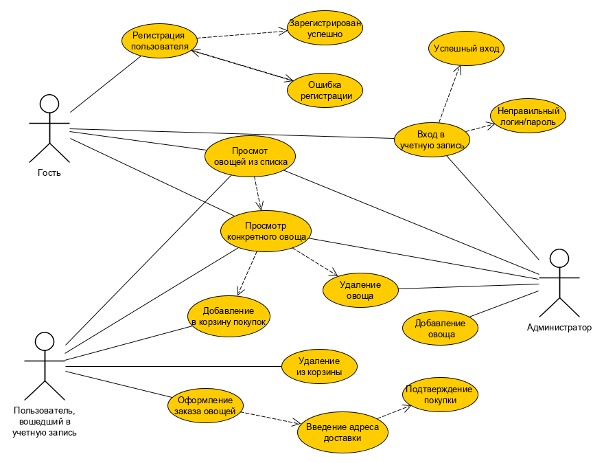
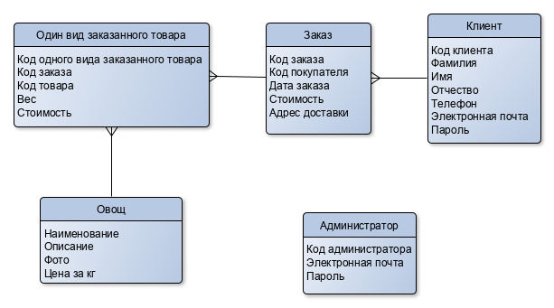
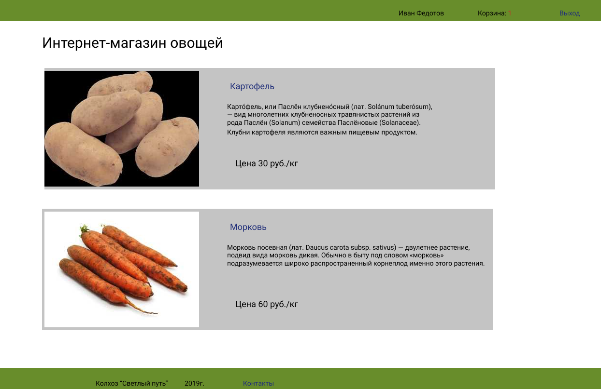

# Разработка архитектуры web приложения #
## Название проекта ##
Интернет-магазин овощей

## Краткое описание проблемной области и актуальности ##
Какая проблема

У многих людей не хватаем времени сходить на рынок и купить свежие овощи. А сейчас становится популярным ЗОЖ и правильное питание с разнообразными овощами.

Как решаем

Создаем интернет-магазин овощей.

## Описание ролей пользователя ##
Use-Case диаграмма (основные кейсы)

## Сущности предметной области ##
ER-диаграмма сущностей

## Прототип интерфейса (sketch) со всеми страницами. (выполнить в  https://www.figma.com)  ##

## Архитектура приложения ##
Выбор архитектуры (MPA-SPA)

Multi-page application

## Техническое решение ##
Выбор  Backend-стеков:

Приложение написано на языке программирования C#, используется фреймворк  ASP.NET и технология MVC (Model - View - Controller). 

Выбор  Frontend-стеков:

HTML5, CSS

# Тестирование #
## Модульное тестирование ##
Модульное тестирование (Unit testing) – тестирование каждой атомарной  функциональности приложения отдельно, в искусственно созданной среде. 
Модульный тест представляет собой тестовую функцию, состоящую из нескольких  частей: в первой (Arrange) подготавливаются данные для теста, во второй (Act)  выполняются вызовы тестируемых функций, в третьей (Assert)  проверяется  соответствие полученных данных ожидаемым.   

## Интеграционное тестирование ##
Интеграционное тестирование это тестирование результата их взаимодействия  между собой двух (или нескольких) модулей в какой-либо среде.  Для имитации действий пользователя и воздействия на UI используется  Selenium . Он  позволяет моделировать действия пользователя в браузере.
  
Для интеграционного теста: 

В базу данных при необходимости помещаются данные, необходимые для  теста.  

С помощью Selenium Driver в тесте имитируются действия  пользователя. 

Проверяется состояние страницы — пользователю должно отображаться именно то, что нужно.  

Проверяется состояние базы данных — все данные в базе данных должны соответствовать  ожидаемым. 
